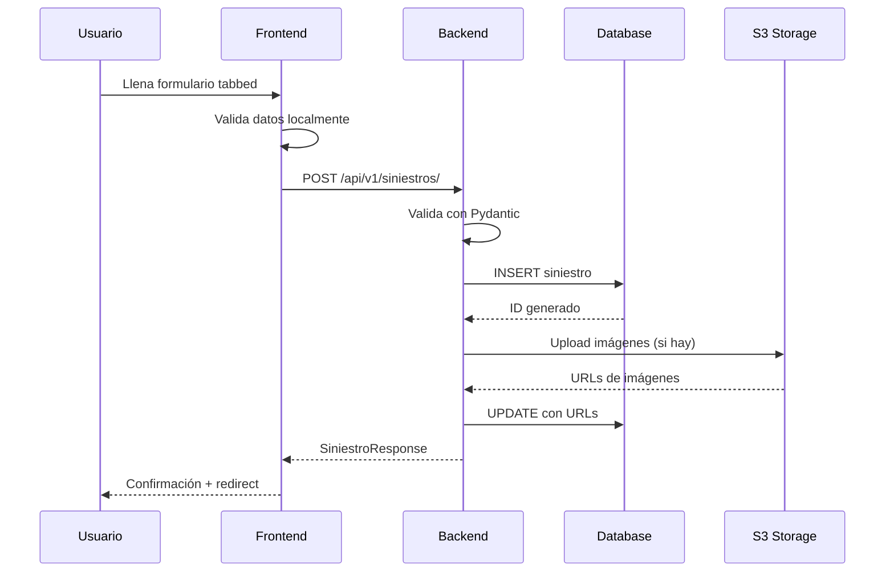
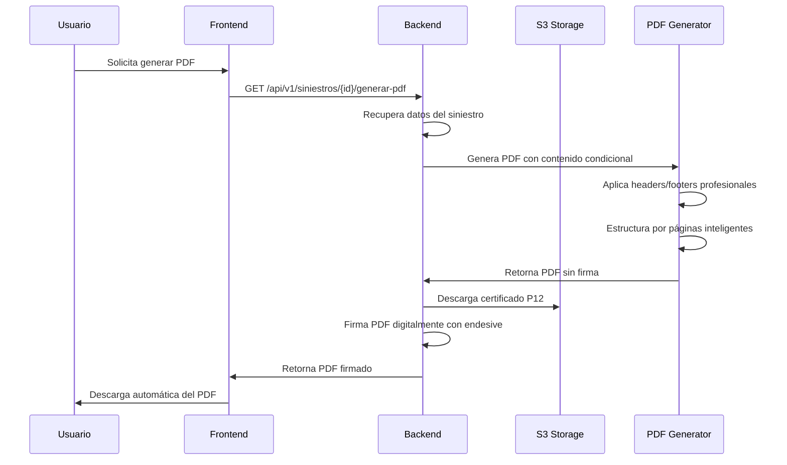

# 🏗️ **Arquitectura del Sistema - Siniestros**

## **📋 MISIVA DE REQUERIMIENTOS DEL SISTEMA**

**Fecha:** 16 de diciembre de 2025
**Destinatario:** Equipo de Desarrollo
**Asunto:** Especificaciones Técnicas para Sistema de Gestión de Siniestros

### **OBJETIVO GENERAL**
Desarrollar un sistema completo de gestión de siniestros que permita la captura, almacenamiento y generación de informes profesionales con inclusión obligatoria de evidencias fotográficas en los documentos PDF generados.

### **REQUERIMIENTOS FUNCIONALES CRÍTICOS**
1. **Captura de Información Completa**: Formularios tabulados para datos del siniestro, partes involucradas y evidencia fotográfica
2. **Almacenamiento Seguro**: Sistema híbrido con base de datos relacional + almacenamiento cloud (AWS S3)
3. **Generación de PDFs Profesionales**: Documentos con firma digital que incluyan TODAS las imágenes subidas
4. **Interfaz Web Completa**: No se aceptan soluciones parciales que redirijan a "plataformas web externas"

### **REQUERIMIENTOS TÉCNICOS ESPECÍFICOS**

#### **1. Gestión de Imágenes**
- ✅ **Subida a AWS S3**: Almacenamiento cloud escalable
- ✅ **URLs Presigned**: Acceso temporal seguro
- ✅ **Base64 Dual**: Almacenamiento en BD para inclusión en PDFs
- ✅ **Formatos Soportados**: JPEG, PNG, WebP
- ✅ **Optimización**: Redimensionamiento automático para PDFs

#### **2. Generación de PDFs**
- ✅ **Inclusión Obligatoria de Imágenes**: NO se aceptan PDFs sin imágenes
- ✅ **Sección Dedicada**: "EVIDENCIAS FOTOGRÁFICAS" con títulos descriptivos
- ✅ **Firma Digital**: Certificado P12 desde S3
- ✅ **Profesional**: Headers, footers, paginación inteligente

#### **3. Arquitectura Técnica**
- ✅ **Backend**: FastAPI + SQLAlchemy + PostgreSQL
- ✅ **Frontend**: React + TypeScript + Vite
- ✅ **Storage**: AWS S3 + Base64 en BD
- ✅ **PDF**: ReportLab + PIL + endesive
- ✅ **Deployment**: Railway (full-stack)

### **RESTRICCIONES ABSOLUTAS**
❌ **NO se acepta**: Mensaje "Las imágenes están disponibles únicamente en la plataforma web"
❌ **NO se acepta**: PDFs sin imágenes embebidas
❌ **NO se acepta**: Soluciones parciales o temporales
❌ **NO se acepta**: Redireccionamiento a sistemas externos

### **ENTREGABLES FINALES**
1. **Sistema Completo**: Funcional desde la captura hasta el PDF final
2. **Imágenes en PDFs**: Obligatorio, no opcional
3. **Documentación Técnica**: Esta especificación en todos los documentos
4. **Pruebas**: Validación completa del flujo de imágenes

### **FIRMA**
**Susana Espinosa - Investigadora de Siniestros**
**Fecha:** 16/12/2025

---

## **Visión General de la Arquitectura**

Siniestros sigue una arquitectura **cliente-servidor** moderna con separación clara de responsabilidades, utilizando las mejores prácticas de desarrollo web contemporáneo.

```
┌─────────────────┐    HTTP/HTTPS    ┌─────────────────┐
│   Frontend      │◄────────────────►│     Backend     │
│   React SPA     │                  │   FastAPI REST  │
│                 │                  │                 │
│ • React 18      │                  │ • FastAPI       │
│ • TypeScript    │                  │ • SQLAlchemy    │
│ • Vite          │                  │ • Pydantic      │
│ • Axios         │                  │ • PostgreSQL    │
└─────────────────┘                  └─────────────────┘
         │                                   │
         └───────────── Railway ─────────────┘
```

## **Arquitectura Frontend**

### **Estructura de Componentes**

```
frontend/
├── src/
│   ├── components/           # Componentes React
│   │   ├── SiniestroForm.tsx    # Formulario principal (tabbed)
│   │   ├── SiniestroDetail.tsx  # Vista de detalle
│   │   ├── SiniestrosList.tsx   # Lista de siniestros
│   │   └── ...
│   ├── App.tsx               # Componente raíz con routing
│   ├── App.css               # Estilos globales
│   ├── index.tsx             # Punto de entrada
│   └── ...
├── public/                   # Assets estáticos
└── package.json
```

### **Patrón de Estado**

```typescript
// Estado centralizado por componente
const SiniestroForm: React.FC = () => {
  const [activeTab, setActiveTab] = useState(0);
  const [completedTabs, setCompletedTabs] = useState<number[]>([]);
  const [formData, setFormData] = useState<FormData>({...});
  const [loading, setLoading] = useState(false);
  const [message, setMessage] = useState("");
};
```

### **Manejo de Formularios**

```typescript
// Patrón de manejo unificado
const handleInputChange = (e: React.ChangeEvent<HTMLInputElement | HTMLTextAreaElement | HTMLSelectElement>) => {
  const { name, value, type } = e.target;
  const checked = (e.target as HTMLInputElement).checked;

  setFormData(prev => ({
    ...prev,
    [name]: type === "checkbox" ? checked : value,
  }));
};
```

### **Sistema de Navegación por Pestañas**

```typescript
// Lógica de navegación progresiva
const tabs = [
  { id: 0, title: "Información Básica", icon: "📋" },
  { id: 1, title: "Parametrización", icon: "⚙️" },
  { id: 2, title: "Entidades", icon: "👥" },
  { id: 3, title: "Investigación", icon: "🔍" },
];

const nextTab = () => {
  if (activeTab < tabs.length - 1) {
    setCompletedTabs(prev => [...prev, activeTab]);
    setActiveTab(activeTab + 1);
  }
};
```

## **Arquitectura Backend**

### **Estructura de la API**

```
backend/
├── app/
│   ├── main.py              # Configuración FastAPI + CORS
│   ├── database.py          # Conexión PostgreSQL
│   ├── models/              # Modelos SQLAlchemy
│   │   └── siniestro.py
│   ├── schemas/             # Esquemas Pydantic
│   │   └── siniestro.py
│   ├── routers/             # Endpoints REST
│   │   └── siniestros.py
│   ├── services/            # Lógica de negocio (Pydantic-native)
│   │   ├── siniestro_service.py  # CRUD operations
│   │   ├── pdf_service.py        # PDF generation
│   │   ├── validation_service.py # Business rules
│   │   └── s3_service.py         # Cloud storage
│   ├── utils/               # Utilidades
│   │   └── pdf_generator.py
│   └── tests/               # Tests automatizados
│       └── test_pydantic_service_integration.py
├── requirements.txt
└── Procfile
```

### **Arquitectura Unificada Pydantic-Native**

```
┌─────────────────┐    Pydantic Models    ┌─────────────────┐
│   FastAPI       │◄────────────────────►│  Service Layer  │
│   (Validation)  │                      │  (Business Logic)│
│                 │                      │                 │
│ • Request/Response│                     │ • CRUD Operations│
│ • Auto-validation│                     │ • Data Processing│
│ • Type Safety    │                     │ • Pydantic Direct│
└─────────────────┘                      └─────────────────┘
         │                                           │
         └────────────────── SQLAlchemy ─────────────┘
```

**Beneficios de la Arquitectura Unificada:**
- ✅ **Type Safety End-to-End**: Pydantic models desde HTTP hasta DB
- ✅ **Zero Conversion Overhead**: Sin transformación manual de tipos
- ✅ **Validation Consistency**: Pydantic + business rules complementarios
- ✅ **Developer Experience**: IntelliSense y refactoring seguros
- ✅ **Runtime Safety**: Validación automática en todas las capas

### **Evolución Arquitectónica: Pydantic-Native Services**

**Contexto:** Inicialmente existía un desacople entre FastAPI (Pydantic models) y Service Layer (dicts), causando errores de conversión manual.

**Solución Implementada (Phase 1-2):**
```python
# ANTES: Conversión manual problemática
@app.put("/{id}/seccion/antecedentes")
async def guardar_seccion(datos: List[AntecedenteInput], ...):
    # ❌ Conversión manual → errores de tipos
    processed_data = [item.model_dump() for item in datos]
    result = service.update_section(id, "antecedentes", processed_data)

# DESPUÉS: Arquitectura Pydantic-native
@app.put("/{id}/seccion/antecedentes")
async def guardar_seccion(datos: List[AntecedenteInput], ...):
    # ✅ Service layer acepta Pydantic directamente
    result = service.update_section(id, "antecedentes", datos)
```

**Service Layer Evolution:**
```python
# ANTES: Solo dicts
def update_section(self, id, section, data: Any) -> Dict

# DESPUÉS: Pydantic-native con backward compatibility
def update_section(self, id, section, data: Union[List[BaseModel], BaseModel, Any]) -> Dict:
    # Conversión automática cuando es necesario para DB
    if hasattr(item, 'model_dump'):
        item_data = item.model_dump()
    else:
        item_data = item
```

**Beneficios de la Evolución:**
- 🔄 **Zero Breaking Changes**: Funciona con código existente
- 🔄 **Gradual Adoption**: Nuevos endpoints aprovechan Pydantic
- 🔄 **Type Safety**: IntelliSense completo en services
- 🔄 **Performance**: Sin overhead de conversión innecesaria
- 🔄 **Maintainability**: Un solo modelo de datos end-to-end

### **Modelo de Datos**

```python
# SQLAlchemy Model
class Siniestro(Base):
    __tablename__ = "siniestros"

    id = Column(Integer, primary_key=True, index=True)
    compania_seguros = Column(String, nullable=False)
    reclamo_num = Column(String, nullable=False, unique=True)
    fecha_siniestro = Column(Date, nullable=False)
    fecha_reportado = Column(Date)
    # ... campos adicionales

    # Relaciones
    relatos_asegurado = relationship("RelatoAsegurado", back_populates="siniestro")
    inspecciones = relationship("Inspeccion", back_populates="siniestro")
    testigos = relationship("Testigo", back_populates="siniestro")
```

### **Esquemas Pydantic**

```python
# Request/Response Schemas
class SiniestroCreate(BaseModel):
    compania_seguros: str
    reclamo_num: str
    fecha_siniestro: date
    fecha_reportado: Optional[date] = None
    # ... campos con validaciones

class SiniestroResponse(SiniestroCreate):
    id: int
    created_at: datetime
    updated_at: datetime

    class Config:
        from_attributes = True
```

### **Endpoints REST**

```python
# CRUD completo
@app.post("/api/v1/siniestros/", response_model=SiniestroResponse)
async def create_siniestro(siniestro: SiniestroCreate, db: Session = Depends(get_db)):
    return await create_siniestro_service(siniestro, db)

@app.get("/api/v1/siniestros/", response_model=List[SiniestroResponse])
async def list_siniestros(db: Session = Depends(get_db)):
    return await list_siniestros_service(db)

@app.get("/api/v1/siniestros/{siniestro_id}", response_model=SiniestroResponse)
async def get_siniestro(siniestro_id: int, db: Session = Depends(get_db)):
    return await get_siniestro_service(siniestro_id, db)
```

## **Flujo de Datos**

### **Creación de Siniestro**



### **Carga de Imágenes**

```python
# Servicio de S3
async def upload_image_to_s3(file: UploadFile, siniestro_id: int) -> str:
    # Generar nombre único
    file_extension = Path(file.filename).suffix
    unique_filename = f"siniestro_{siniestro_id}_{uuid4()}{file_extension}"

    # Upload a S3
    s3_client.upload_fileobj(
        file.file,
        BUCKET_NAME,
        unique_filename,
        ExtraArgs={"ACL": "public-read"}
    )

    # Retornar URL pública
    return f"https://{BUCKET_NAME}.s3.amazonaws.com/{unique_filename}"
```

### **Generación de PDFs con Firma Digital**



## **Seguridad y Validación**

### **Validaciones Frontend**
- **TypeScript**: Tipado estático
- **ESLint**: Reglas de calidad de código
- **Validación local**: Campos requeridos, formatos

### **Validaciones Backend**
- **Pydantic**: Validación automática de schemas
- **SQLAlchemy**: Constraints a nivel de BD
- **Sanitización**: Limpieza de datos de entrada

### **Autenticación y Autorización**
```python
# Futuro: JWT + OAuth2
from fastapi.security import HTTPBearer, HTTPAuthorizationCredentials

security = HTTPBearer()

async def get_current_user(credentials: HTTPAuthorizationCredentials = Depends(security)):
    # Validar token JWT
    # Retornar usuario autenticado
    pass
```

## **Despliegue y DevOps**

### **Railway Configuration**

```toml
# railway.toml
[build]
builder = "NIXPACKS"

[deploy]
healthcheckPath = "/api/v1/health"
healthcheckTimeout = 300
restartPolicyType = "ON_FAILURE"
```

### **Environment Variables**

```bash
# Frontend
REACT_APP_BACKEND_URL=https://siniestros-production.up.railway.app
REACT_APP_ENV=production

# Backend
DATABASE_URL=postgresql://...
AWS_ACCESS_KEY_ID=...
AWS_SECRET_ACCESS_KEY=...
AWS_S3_BUCKET=...
```

### **CI/CD Pipeline**

```yaml
# GitHub Actions (futuro)
name: Deploy
on:
  push:
    branches: [ main ]

jobs:
  test:
    runs-on: ubuntu-latest
    steps:
      - uses: actions/checkout@v3
      - name: Test Frontend
        run: cd frontend && npm test
      - name: Test Backend
        run: cd backend && python -m pytest
```

## **Monitoreo y Observabilidad**

### **Logging**
```python
import logging

logging.basicConfig(
    level=logging.INFO,
    format='%(asctime)s - %(name)s - %(levelname)s - %(message)s'
)

logger = logging.getLogger(__name__)
```

### **Health Checks**
```python
@app.get("/api/v1/health")
async def health_check(db: Session = Depends(get_db)):
    # Verificar conexión a BD
    try:
        db.execute("SELECT 1")
        return {"status": "healthy", "database": "connected"}
    except Exception as e:
        logger.error(f"Health check failed: {e}")
        return {"status": "unhealthy", "database": "disconnected"}
```

### **Métricas de Rendimiento**
- **Tiempo de respuesta** de endpoints
- **Tasa de error** de requests
- **Uso de recursos** (CPU, memoria)
- **Latencia de queries** a BD

## **Escalabilidad y Rendimiento**

### **Optimizaciones Frontend**
- **Code splitting** con Vite
- **Lazy loading** de componentes
- **Memoización** con React.memo
- **Virtualización** para listas grandes

### **Optimizaciones Backend**
- **Connection pooling** con SQLAlchemy
- **Caching** con Redis (futuro)
- **Async/await** para operaciones I/O
- **Background tasks** para procesamiento pesado

### **Base de Datos**
- **Índices** en campos de búsqueda frecuentes
- **Particionamiento** para tablas grandes (futuro)
- **Read replicas** para consultas de solo lectura
- **Backup automático** diario

## **Testing Strategy**

### **Pirámide de Testing**
```
End-to-End Tests    ┌─────────────┐
   (Cypress)        │     10      │
                    └─────────────┘
Integration Tests   ┌─────────────┐
   (FastAPI TestClient) │    50      │
                    └─────────────┘
Unit Tests          ┌─────────────┐
   (pytest)         │    100     │
                    └─────────────┘
```

### **Ejemplos de Tests**

```python
# Test unitario
def test_create_siniestro_validation():
    siniestro_data = {"compania_seguros": "", "reclamo_num": "TEST-001"}
    with pytest.raises(ValidationError):
        SiniestroCreate(**siniestro_data)

# Test de integración
def test_create_siniestro_endpoint(client, db_session):
    response = client.post("/api/v1/siniestros/", json=siniestro_data)
    assert response.status_code == 201
    assert "id" in response.json()
```

## **Consideraciones de Seguridad**

### **OWASP Top 10**
- ✅ **SQL Injection**: Usando SQLAlchemy ORM
- ✅ **XSS**: Sanitización automática en React
- ✅ **CSRF**: Tokens en formularios sensibles
- ✅ **Rate Limiting**: Implementado en Railway
- ⚠️ **Broken Access Control**: Por implementar (futuro)

### **Mejores Prácticas**
- **Input validation** en todos los endpoints
- **CORS configuration** restrictiva
- **HTTPS only** en producción
- **Secure headers** con FastAPI middleware
- **Error handling** sin leakage de información sensible

Esta arquitectura proporciona una base sólida, escalable y mantenible para el sistema de gestión de siniestros.
