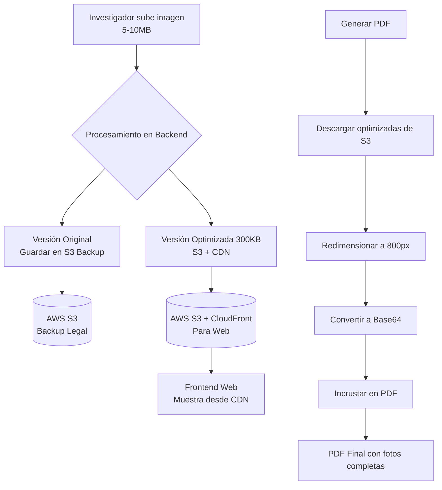

> **NOTA: ARQUITECTURA DEFINITIVA**
>
> Este documento describe la arquitectura técnica definitiva del sistema de PDFs.
> Se ha optado por una solución balanceada que mantiene PostgreSQL ligero
> mientras garantiza PDFs autocontenidos con fotos de calidad para impresión.

## 🏗️ **Arquitectura Técnica del Sistema de PDF**

### 📁 SISTEMA DE ALMACENAMIENTO INTELIGENTE

#### **1. ORIGINALES EN S3 (Backup Legal)**
**Propósito**: Evidencia forense / Requerimientos legales  
**Tamaño**: 5-10MB por imagen (calidad original)  
**Acceso**: Solo para casos excepcionales (juez, auditoría)  
**Retención**: 5 años mínimo  
**Costo**: ~$2.30/mes por 100GB  

#### **2. OPTIMIZADAS EN S3+CDN (Para Navegador Web)**
**Propósito**: Visualización rápida en interfaz web  
**Tamaño**: 300-500KB (1200px máximo, calidad 85%)  
**Acceso**: Frontend de la aplicación via CloudFront CDN  
**Almacenamiento**: AWS S3 + CloudFront para caché global  
**Costo**: ~$0.14/mes por 6GB  

#### **3. VERSIÓN PDF (Generada al vuelo - NO en PostgreSQL)**
**Propósito**: Incrustación directa en documentos PDF  
**Proceso**: Al generar PDF → Descargar optimizada de S3 → Redimensionar → Base64  
**Tamaño**: 150-200KB (800-1000px, calidad impresión)  
**Ventaja**: PostgreSQL permanece ligero (solo URLs)  
**Resultado**: PDF autocontenido con fotos legibles  

### **🔄 FLUJO DE PROCESAMIENTO CORREGIDO**



### **📐 DISTRIBUCIÓN EN PDF**

**PARA IMÁGENES HORIZONTALES:**
```
┌─────────────────────────────────┐
│                                 │
│    [1 IMAGEN POR FILA COMPLETA] │ ← Ancho: 6.27" (15.9cm)
│    Ideal para:                  │    Alto: 3.5-4.0"
│    • Panoramas de accidente     │
│    • Daños extensos             │
│    • Escenas generales          │
│                                 │
└─────────────────────────────────┘
```

**PARA IMÁGENES VERTICALES:**
```
┌───────────────┐ ┌───────────────┐
│               │ │               │
│  [2 IMÁGENES  │ │  POR FILA]    │ ← Ancho: 3.13" c/u (7.95cm)
│  Ideal para:  │ │               │    Alto: 4.0-4.5"
│  • Documentos │ │  • Retratos   │
│  • DNI/Lic    │ │  • Testigos   │
│  • Lesiones   │ │  • Detalles   │
└───────────────┘ └───────────────┘
```

### **⚙️ PROCESO DE GENERACIÓN DE PDF**

**PASO 1: Recopilación de datos**
- Información básica del siniestro
- Entidades involucradas (asegurado, conductor, etc.)
- Investigación (antecedentes, relatos, inspecciones)
- Imágenes con URLs y orientación especificada

**PASO 2: Construcción del documento**
- Página 1: Carátula e índice
- Página 2: Datos del siniestro
- Página 3-n: Investigación con imágenes distribuidas
- Página final: Conclusiones y espacio para firma

**PASO 3: Incrustación de imágenes**
- Para cada imagen:
  - Descargar versión optimizada desde S3 (URL en PostgreSQL)
  - Redimensionar a calidad PDF (800px máximo)
  - Convertir a Base64 en memoria
  - Aplicar distribución según orientación:
    - Horizontal: 1 por fila, ancho completo
    - Vertical: 2 por fila, lado a lado
- Mantener proporciones originales
- Optimizar tamaño para impresión

**PASO 4: Firma y exportación**
- Aplicar firma digital automática (certificado P12)
- O dejar espacio para firma manual (tribunales)
- Generar PDF final autocontenido
- Nombre: `{número_reclamo}.pdf`

### **🔒 CARACTERÍSTICAS DE SEGURIDAD Y CONFIABILIDAD**

**AUTOCONTENIDO:**
- ✅ Todas las imágenes incrustadas (Base64 generado al vuelo)
- ✅ Sin dependencia de URLs externas en PDF final
- ✅ Funciona offline / sin conexión

**FIRMA DIGITAL:**
- ✅ Certificado P12 almacenado en S3
- ✅ Validación de integridad del documento
- ✅ Compatible con lectores PDF estándar
- ✅ Opción de firma manual para tribunales

**ALMACENAMIENTO INTELIGENTE:**
- ✅ PostgreSQL ligero (solo URLs, no Base64)
- ✅ S3 para almacenamiento escalable de imágenes
- ✅ CDN para entrega rápida al navegador
- ✅ Backup legal de originales por 5+ años

### **📊 ESPECIFICACIONES TÉCNICAS**

**FORMATO DE SALIDA:**
- PDF 1.7 compatible con Adobe Acrobat 8+
- Compresión: Flate (optimizado)
- Resolución imágenes: 150 DPI (óptimo impresión)
- Tamaño página: A4 (21×29.7cm)
- Codificación: UTF-8

**TAMAÑOS ESTIMADOS:**
- PDF sin imágenes: 50-100KB
- Por imagen horizontal: +150-200KB
- Por imagen vertical: +100-150KB c/u
- PDF típico (5-10 imágenes): 1-2MB

**RENDIMIENTO:**
- Generación: 3-8 segundos (descarga + procesamiento imágenes)
- Disponibilidad: 24/7
- Escalabilidad: Hasta 100 PDFs simultáneos
- PostgreSQL: Ligero (~2MB para 1000 informes)

### **✅ BENEFICIOS DE ESTA ARQUITECTURA**

| Ventaja | Descripción |
|---------|-------------|
| **PDFs Profesionales** | Fotos completas (800px), legibles, listas para impresión |
| **Base de Datos Ligera** | PostgreSQL solo almacena URLs (~2MB para 1000 informes) |
| **Costos Optimizados** | S3 barato para almacenamiento, BD pequeña para Railway |
| **Cumplimiento Legal** | Originales disponibles en S3 por 5+ años para tribunales |
| **Escalabilidad** | Miles de informes sin degradar rendimiento de BD |
| **Flexibilidad** | PDFs para impresión (jueces) y digital (clientes) |


### **🔄 FLUJO PASO A PASO (como usuario)**

**DÍA 1: Investigador en campo**

1. Tomas fotos del accidente con celular
2. En la app web:
   - Subes las fotos
   - Escribes: "Foto 1: Daño frontal" → Seleccionas "Horizontal"
   - Escribes: "Foto 2: DNI conductor" → Seleccionas "Vertical"
3. Sistema automáticamente:
   - Guarda originales en caja fuerte (S3)
   - Crea copias optimizadas para web
   - Apunta en agenda dónde están

**DÍA 2: Creas el informe**

1. En la app: Botón "Generar PDF"
2. Sistema:
   - Lee de la agenda dónde están las fotos
   - Va al almacén (S3) y baja las optimizadas
   - Las ajusta para imprimir bien
   - Las mete DENTRO del PDF
   - Organiza: Horizontal = 1 por fila, Vertical = 2 por fila
3. Descargas PDF → Tiene TODAS las fotos DENTRO

**DÍA 3: Entregas el informe**

**OPCIÓN A (Para juez):**
- Imprimes PDF en papel
- Firmas con tinta
- Entregas físico

**OPCIÓN B (Para cliente):**
- Envías PDF por email
- Cliente abre en computadora
- Ve fotos sin necesidad de internet
