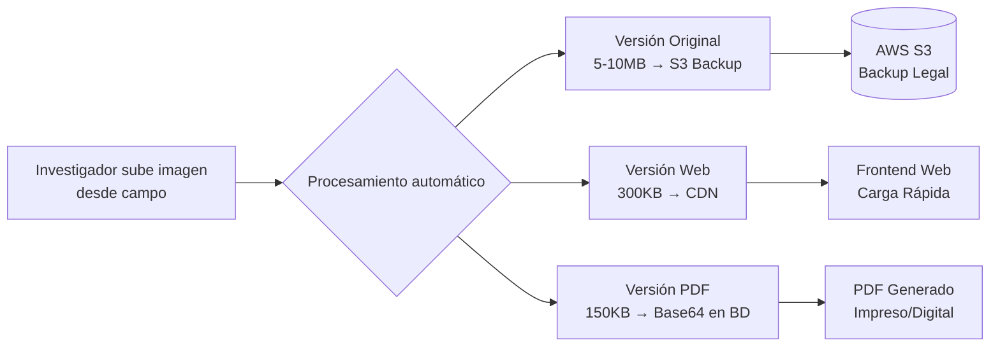

> **NOTA: ARQUITECTURA EN REVISIÓN**
>
> Este documento describe la arquitectura técnica propuesta para el sistema de PDFs.
> Los aspectos de almacenamiento (Base64 en PostgreSQL vs generación desde S3)
> están siendo evaluados para optimizar costos y rendimiento.

## 🏗️ **Arquitectura Técnica del Sistema de PDF**

### **📁 ALMACENAMIENTO DE IMÁGENES (3 Niveles)**

```
1. ORIGINALES (AWS S3)
   └─ Para: Backup forense / Casos legales
   └─ Tamaño: 5-10MB c/u
   └─ Acceso: Solo si juez/auditoría lo requiere

2. OPTIMIZADAS (AWS S3 + CloudFront CDN)
   └─ Para: Visualización en navegador web
   └─ Tamaño: 300-500KB c/u (1200px máximo)
   └─ Acceso: Frontend de la aplicación

3. VERSIÓN PDF (Base64 en PostgreSQL)
   └─ Para: Incrustación directa en PDF
   └─ Tamaño: 150-200KB c/u (800-1000px)
   └─ Distribución: Según selección del investigador
```

### **🔄 FLUJO DE PROCESAMIENTO**



### **📐 DISTRIBUCIÓN EN PDF**

```
PARA IMÁGENES HORIZONTALES:
┌─────────────────────────────────┐
│                                 │
│    [1 IMAGEN POR FILA COMPLETA] │ ← Ancho: 6.27" (15.9cm)
│    Ideal para:                  │    Alto: 3.5-4.0"
│    • Panoramas de accidente     │
│    • Daños extensos             │
│    • Escenas generales          │
│                                 │
└─────────────────────────────────┘

PARA IMÁGENES VERTICALES:
┌───────────────┐ ┌───────────────┐
│               │ │               │
│  [2 IMÁGENES  │ │  POR FILA]    │ ← Ancho: 3.13" c/u (7.95cm)
│  Ideal para:  │ │               │    Alto: 4.0-4.5"
│  • Documentos │ │  • Retratos   │
│  • DNI/Lic    │ │  • Testigos   │
│  • Lesiones   │ │  • Detalles   │
└───────────────┘ └───────────────┘
```

### **⚙️ PROCESO DE GENERACIÓN DE PDF**

```
PASO 1: Recopilación de datos
   ├─ Información básica del siniestro
   ├─ Entidades involucradas (asegurado, conductor, etc.)
   ├─ Investigación (antecedentes, relatos, inspecciones)
   ├─ Imágenes con orientación especificada

PASO 2: Construcción del documento
   ├─ Página 1: Carátula e índice
   ├─ Página 2: Datos del siniestro
   ├─ Página 3-n: Investigación con imágenes distribuidas
   └─ Página final: Conclusiones y firma digital

PASO 3: Incrustación de imágenes
   ├─ Extraer Base64 desde PostgreSQL
   ├─ Aplicar distribución según orientación:
   │   • Horizontal: 1 por fila, ancho completo
   │   • Vertical: 2 por fila, lado a lado
   ├─ Mantener proporciones originales
   └─ Optimizar tamaño para impresión

PASO 4: Firma y exportación
   ├─ Aplicar firma digital con certificado P12
   ├─ Generar PDF final autocontenido
   └─ Nombre: {número_reclamo}.pdf
```

### **🔒 CARACTERÍSTICAS DE SEGURIDAD Y CONFIABILIDAD**

```
AUTOCONTENIDO:
   ✓ Todas las imágenes incrustadas (Base64)
   ✓ Sin dependencia de URLs externas
   ✓ Funciona offline / sin conexión

FIRMA DIGITAL:
   ✓ Certificado P12 almacenado en S3
   ✓ Validación de integridad del documento
   ✓ Compatible con lectores PDF estándar

BACKUP:
   ✓ Originales en S3 por 5 años (requerimiento legal)
   ✓ Versiones PDF en sistema de archivos
   ✓ Metadatos en base de datos relacional
```

### **📊 ESPECIFICACIONES TÉCNICAS**

```
FORMATO DE SALIDA:
   • PDF 1.7 compatible con Adobe Acrobat 8+
   • Compresión: Flate (optimizado)
   • Resolución imágenes: 150 DPI (óptimo impresión)
   • Tamaño página: A4 (21×29.7cm)
   • Codificación: UTF-8

TAMAÑOS ESTIMADOS:
   • PDF sin imágenes: 50-100KB
   • Por imagen horizontal: +150-200KB
   • Por imagen vertical: +100-150KB c/u
   • PDF típico (5-10 imágenes): 1-2MB

RENDIMIENTO:
   • Generación: 2-5 segundos (dependiendo de imágenes)
   • Disponibilidad: 24/7
   • Escalabilidad: Hasta 100 PDFs simultáneos
```

### **✅ BENEFICIOS DE ESTA ARQUITECTURA**

| Ventaja | Descripción |
|---------|-------------|
| **PDFs Confiables** | Autocontenidos, funcionan sin internet |
| **Calidad Garantizada** | Imágenes legibles tanto digital como impreso |
| **Cumplimiento Legal** | Válido para tribunales y auditorías |
| **Rendimiento Óptimo** | Base de datos no se satura |
| **Costos Controlados** | Almacenamiento inteligente por niveles |
| **Escalabilidad** | Crece con el negocio sin problemas |

---

## 🖨️ Sistema de Generación e Impresión de PDFs

### Flujo de Trabajo del Investigador
1. **Recolección en campo**: Ingresa datos, sube fotos, documenta evidencias
2. **Generación del informe**: Solicita generación del PDF desde el sistema
3. **Revisión y firma**: 
   - Descarga el PDF generado
   - Imprime en calidad óptima
   - Firma manualmente o electrónicamente
4. **Entrega al cliente**:
   - **Versión física**: Entrega impresa y firmada
   - **Versión digital**: Sube PDF firmado al sistema del cliente
5. **Archivamiento**: El sistema almacena el PDF firmado para futuras referencias

### Características del PDF Generado
- **Fotos incrustadas**: Imágenes distribuidas según orientación especificada
- **Calidad óptima**: Resolución adecuada para impresión profesional (800-1000px)
- **Distribución inteligente**:
  - Horizontal: 1 imagen por fila (ancho completo)
  - Vertical: 2 imágenes por fila (lado a lado)
- **Autocontenido**: No depende de URLs externas, funciona offline
- **Listo para firma**: Espacio designado para firma manual o digital

### Almacenamiento y Gestión
- **Fotos originales**: AWS S3 (backup a largo plazo)
- **Versiones web**: AWS S3 + CloudFront (visualización en navegador)
- **PDFs finales**: Almacenados en S3, referenciados en base de datos
- **Regeneración**: Posibilidad de regenerar PDFs con diferentes configuraciones

### Ventajas del Sistema
- ✅ **Control total**: El investigador decide cuándo y cómo generar
- ✅ **Costo optimizado**: Base de datos ligera, almacenamiento escalable
- ✅ **Calidad garantizada**: Fotos legibles tanto impresas como digitales
- ✅ **Flujo profesional**: Adecuado para entregas a clientes y procesos legales


## 🔍 **Elementos que FALTAN en ARQUITECTURA_PDF.md** (para agregar):

### **1. Gestión de Firmas (Manual vs. Digital):**

### **⚖️ Sistema de Firmas Dual**

#### **Opción A: Firma Manual (Recomendada para tribunales)**

**ESPACIO EN PDF:**
```
┌─────────────────────────────────┐
│                                 │
│        RECOMENDACIONES          │
│          CONCLUSIONES           │
│                                 │
│ _______________________________ │
│     Firma del Investigador      │
│                                 │
│ _______________________________ │
│      Nombre Completo            │
│                                 │
│ _______________________________ │
│    Cédula de Identidad          │
│                                 │
│ Fecha: ________________________ │
│                                 │
└─────────────────────────────────┘
```

**Flujo:**
1. Investigador imprime PDF
2. Firma manualmente con tinta
3. Escanea o entrega físico
4. Sube versión escaneada al sistema

#### **Opción B: Firma Digital Automática**
- Certificado P12 almacenado en S3
- Firma aplicada automáticamente al generar PDF
- Validación criptográfica incorporada
- Compatible con lectores PDF estándar

### **2. Control de Versiones de PDFs:**

### **🔄 Sistema de Versiones de PDF**

**Estructura de almacenamiento:**
```
s3://bucket/pdfs/
├── {numero_reclamo}/
│   ├── v1_{timestamp}.pdf    # Primera versión
│   ├── v2_{timestamp}.pdf    # Regenerado con cambios
│   ├── v3_firmado.pdf        # Versión firmada
│   └── metadata.json         # Metadatos de generación
```

**Metadatos almacenados:**
```json
{
  "version": 3,
  "generated_at": "2024-01-15T10:30:00Z",
  "generated_by": "investigador_id",
  "signature_type": "manual|digital",
  "image_count": 15,
  "pdf_size_kb": 1850,
  "orientation_summary": {
    "horizontal": 8,
    "vertical": 7
  }
}
```

### **3. Proceso de Regeneración:**

### **🔄 Regeneración de PDFs**

**Casos de uso para regeneración:**
1. **Corrección de datos**: Si se actualiza información del siniestro
2. **Cambio de calidad**: Diferente resolución para diferentes destinatarios
3. **Re-firmado**: Nueva firma requerida
4. **Formato diferente**: Versión para email vs. impresión

**Parámetros de regeneración:**
```python
{
  "image_quality": "high|medium|low",      # 150 DPI, 120 DPI, 96 DPI
  "include_original_images": true|false,   # Incluir fotos originales
  "signature": "none|digital|space_for",   # Tipo de firma
  "watermark": "draft|final|confidential", # Marca de agua
  "page_size": "A4|letter|legal"          # Tamaño de página
}
```
